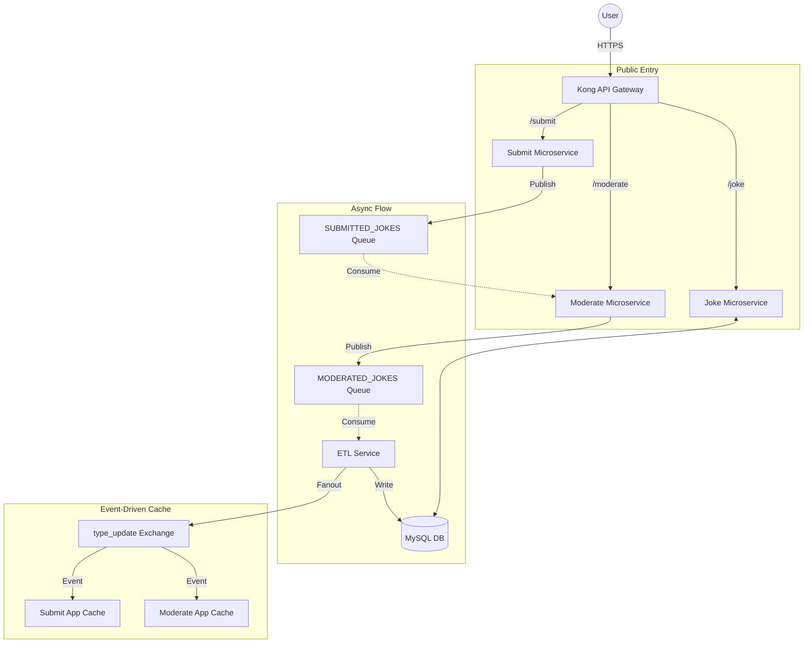

# Technical Explanation: Joke Distributed System

This document provides a deep dive into the architecture, components, and communication flows of the Joke Distributed System. It covers the evolution from a monolithic application (Option 1) to a full microservices architecture with an API Gateway and Infrastructure as Code (Option 3).

---

## 1. Architectural Evolution

### Phase 1: The Monolith (Option 1)
Originally, the application was a single-server setup where the submission and retrieval of jokes happened in one process, directly interacting with a private MySQL database.
- **Risk**: A spike in joke submissions could slow down or crash the entire joke-serving experience.

### Phase 2: Microservices & Messaging (Option 2)
We decoupled the system into two primary microservices (Joke and Submit) and introduced **RabbitMQ** to handle communication asynchronously.
- **Improvement**: Submissions are now buffered in a queue, protecting the database from spikes and ensuring zero data loss if the backend goes offline.

### Phase 3: Gateway & Automation (Option 3)
The final architecture adds a **Kong API Gateway** for centralized routing and security, along with **Terraform** for automated Azure infrastructure provisioning.
- **Result**: A professional-grade, resilient, and secure distributed system.

---

## 2. Infrastructure & Deployment (Azure + Terraform)

The entire environment is built using **Terraform**, ensuring the infrastructure is reproducible and version-controlled.

- **VM1 (Joke Service)**: Runs the MySQL database, the Joke App, and the ETL process.
- **VM2 (Submit Service)**: Runs the Submit App and the RabbitMQ message broker.
- **VM3 (Moderation/Gateway)**: Runs the Moderate App and the Kong API Gateway (provisioned via Terraform).
- **Private Networking**: Azure Virtual Network (VNet) allows the VMs to communicate securely over private IPs (10.0.0.x), keeping internal traffic off the public internet.

---

## 3. The Microservices Breakdown

### 🏗️ Joke Microservice (VM1)
- **Joke App (Node.js/Express)**: Serves the core joke-reading logic. It fetches jokes directly from MySQL and provides the `/types` endpoint.
- **ETL Service (RabbitMQ Consumer)**: The "worker" of the system. It listens for messages on the `MODERATED_JOKES` queue, parses the data, and writes approved jokes into MySQL.
- **MySQL Database**: The central persistent store for all jokes and types.

### 📪 Submit Microservice (VM2)
- **Submit App (Node.js/Express)**: The entry point for new jokes. It performs initial validation and publishes the joke to the `SUBMITTED_JOKES` queue.
- **RabbitMQ**: The reliable message broker holding the `SUBMITTED_JOKES` and `MODERATED_JOKES` queues.

### ⚖️ Moderate Microservice (VM3/VM2)
- **Moderate App**: A specialized tool for joke moderation. It pulls jokes from `SUBMITTED_JOKES`, allows a moderator to Approve or Reject them, and forwards approved jokes to the `MODERATED_JOKES` queue for the ETL service to pick up.
- **Authentication**: Secured with OIDC (Auth0) to ensure only authorized personnel can moderate content.

---

## 4. End-to-End Communication Flow

The system uses a combination of **Async Messaging (RabbitMQ)** and **Event-Driven Updates (Fanout)**.

### Key Message Queues:
1. **`SUBMITTED_JOKES`**: Raw submissions waiting for moderation.
2. **`MODERATED_JOKES`**: Approved jokes waiting to be archived in the database.

### The "Fanout" Event:
When the ETL service adds a joke with a **new category**, it broadcasts a `type_update` event via a RabbitMQ Fanout exchange. Both the **Submit App** and **Moderate App** listen for this event to update their local category caches instantly, without needing to poll the database.

---

## 5. Security & Resilience

- **Kong Gateway**: Encrypts all traffic with HTTPS (TLS) and enforces **Rate Limiting** (e.g., max 5 requests per minute) to prevent spam.
- **Isolation**: Each microservice runs in its own Docker container. If one service crashes, Docker automatically restarts it, and RabbitMQ continues to hold the messages safely until it's back online.
- **Fault Tolerance**: The Submit App caches joke types locally. If the Joke Service (VM1) goes down, the submission page still works by using the cached types.

---
*Generated by Antigravity - March 14, 2026*
